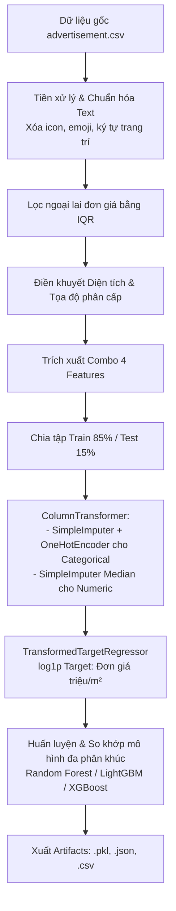

# 🏡 Dự Đoán Giá Bất Động Sản Tại Việt Nam (Vietnam Housing Price Prediction)

[](https://www.python.org/)
[](https://scikit-learn.org/)
[](https://gradio.app/)
[](LICENSE)

> **Đồ án môn học:** Trực quan hóa Dữ liệu (Data Visualization) & Ứng dụng Học máy (Machine Learning)  
> **Chủ đề:** Phân tích, trực quan hóa và xây dựng mô hình dự đoán giá bất động sản tại thị trường Việt Nam dựa trên dữ liệu tin đăng quảng cáo (`advertisement.csv`), kết hợp thuật toán Học máy đa phân khúc và Giao diện Web tương tác trực quan.

---

## 📌 Mục Lục
- [1. Giới thiệu tổng quan](#1-giới-thiệu-tổng-quan)
- [2. Cấu trúc thư mục dự án](#2-cấu-trúc-thư-mục-dự-án)
- [3. Dữ liệu và Khám phá dữ liệu (EDA)](#3-dữ-liệu-và-khám-phá-dữ-liệu-eda)
  - [3.1. Tổng quan tập dữ liệu](#31-tổng-quan-tập-dữ-liệu)
  - [3.2. Phân tích thống kê & Kiểm định](#32-phân-tích-thống-kê--kiểm-định)
  - [3.3. Lựa chọn tổ hợp đặc trưng (Combo 4)](#33-lựa-chọn-tổ-hợp-đặc-trưng-combo-4)
- [4. Quy trình xử lý dữ liệu & Pipeline Huấn luyện](#4-quy-trình-xử-lý-dữ-liệu--pipeline-huấn-luyện)
  - [4.1. Tiền xử lý & Làm sạch dữ liệu](#41-tiền-xử-lý--làm-sạch-dữ-liệu)
  - [4.2. Điền khuyết toạ độ & Diện tích](#42-điền-khuyết-toạ-độ--diện-tích)
  - [4.3. Kiến trúc Pipeline & Biến đổi mục tiêu](#43-kiến-trúc-pipeline--biến-đổi-mục-tiêu)
- [5. Kết quả Benchmark & Đánh giá mô hình](#5-kết-quả-benchmark--đánh-giá-mô-hình)
  - [5.1. Chiến lược Routing mô hình theo phân khúc](#51-chiến-lược-routing-mô-hình-theo-phân-khúc)
  - [5.2. Bảng so sánh hiệu năng chi tiết](#52-bảng-so-sánh-hiệu-năng-chi-tiết)
- [6. Ứng dụng Web dự đoán (Gradio UI)](#6-ứng-dụng-web-dự-đoán-gradio-ui)
- [7. Hướng dẫn cài đặt & Chạy dự án](#7-hướng-dẫn-cài-đặt--chạy-dự-án)
  - [7.1. Cài đặt môi trường](#71-cài-đặt-môi-trường)
  - [7.2. Huấn luyện lại mô hình](#72-huấn-luyện-lại-mô-hình)
  - [7.3. Khởi chạy ứng dụng Web](#73-khởi-chạy-ứng-dụng-web)
- [8. Công nghệ sử dụng](#8-công-nghệ-sử-dụng)

---

## 1. Giới thiệu tổng quan

Thị trường bất động sản Việt Nam có đặc thù phân hóa cao theo vị trí địa lý, phân khúc sản phẩm (nhà ở, căn hộ chung cư, đất nền, văn phòng/mặt bằng kinh doanh) và các biến động về đơn giá theo từng khu vực.

Dự án này giải quyết bài toán **định giá bất động sản** thông qua quy trình khoa học dữ liệu toàn diện:
1. **Phân tích dữ liệu & Trực quan hóa (EDA)**: Tìm hiểu quy luật phân phối, tương quan giữa các biến định tính/định lượng và loại bỏ ngoại lai.
2. **Kỹ thuật đặc trưng (Feature Engineering)**: Đánh giá sức mạnh dự báo của các tổ hợp đặc trưng thông qua ma trận hệ số liên kết **Cramer's V** có hiệu chỉnh.
3. **Huấn luyện mô hình đa phân khúc (Type-Specific ML Routing)**: Áp dụng các thuật toán mạnh mẽ (**Random Forest, XGBoost, LightGBM**) kết hợp biến đổi Log-Target cho đơn giá (`triệu VND/m²`).
4. **Triển khai ứng dụng (Gradio Web UI)**: Cung cấp giao diện trực quan hỗ trợ chuyển đổi thông minh giữa địa giới hành chính mới và cũ, dự đoán giá bán cùng khoảng tin cậy sai số.

---

## 2. Cấu trúc thư mục dự án

```text
Machine-Learning-for-Housing-Price/
│
├── advertisement.csv                    # Tập dữ liệu gốc tin đăng bất động sản (~37k dòng)
├── feature.ipynb                        # Jupyter Notebook: Phân tích khám phá dữ liệu (EDA), kiểm định thống kê & Cramer's V
├── train_combo4_xgboost_pipeline.py     # Script tiền xử lý, huấn luyện và xuất pipeline mô hình hoàn chỉnh
├── app.py                               # Ứng dụng Web dự đoán giá tương tác (Gradio UI)
├── requirements.txt                     # Danh sách thư viện Python cần thiết
│
├── artifacts/                           # Thư mục lưu trữ artifact mô hình & kết quả đánh giá
│   ├── combo4_best_unit_price_pipeline.pkl  # Pipeline mô hình tối ưu đã lưu (Git LFS)
│   ├── combo4_unit_price_metrics.json       # Tổng hợp thông số cấu hình và metrics đánh giá
│   └── combo4_unit_price_benchmark.csv     # Bảng so sánh chi tiết benchmark các mô hình
│
├── .gitattributes                       # Cấu hình Git LFS cho file model binary (.pkl)
├── .gitignore                           # Cấu hình bỏ qua các file tạm/cache
└── README.md                            # Tài liệu hướng dẫn chi tiết của dự án
```

---

## 3. Dữ liệu và Khám phá dữ liệu (EDA)

### 3.1. Tổng quan tập dữ liệu
Tập dữ liệu `advertisement.csv` gồm hơn **37,000+ bản ghi** tin đăng bất động sản tại Việt Nam, bao gồm các nhóm thông tin:
- **Địa lý & Hành chính:** `Tỉnh/Thành phố mới`, `Phường mới`, `Tỉnh/Thành phố cũ`, `Huyện/Quận cũ`, `Phường/Xã cũ`, `Đường`, `Số nhà`, `Kinh độ`, `Vĩ độ`.
- **Đặc điểm bất động sản:** `Loại hình` (Căn hộ/Chung cư, Nhà ở, Đất, Văn phòng mặt bằng), `Diện tích`, `Chiều dài`, `Chiều rộng`, `Số tầng`, `Số phòng ngủ`, `Số phòng vệ sinh`, `Giấy tờ pháp lý`, `Đặc điểm nhà/đất`.
- **Phân loại chi tiết (Subtypes):** `Loại hình nhà ở`, `Loại hình căn hộ`, `Loại hình đất`, `Loại hình văn phòng`.
- **Giá trị mục tiêu:** `Giá bán` (VND) và `Đơn giá (tr/m2)`.

### 3.2. Phân tích thống kê & Kiểm định
Trong notebook `feature.ipynb`, các phân tích chuyên sâu được thực hiện:
- **Phân phối đơn giá:** Giá trị đơn giá có độ lệch phải lớn (right-skewed). Áp dụng phương pháp IQR để loại bỏ các điểm dữ liệu bất thường và sử dụng hàm biến đổi $\log(1 + x)$ để chuẩn hóa phân phối mục tiêu.
- **Kiểm định Kruskal-Wallis & Mann-Whitney U:** Xác định sự khác biệt có ý nghĩa thống kê về mặt phân phối đơn giá giữa các loại hình bất động sản ($p < 0.001$, hiệu chỉnh Bonferroni).
- **Hệ số tương quan & Cramer's V:** Đánh giá mối quan hệ phi tuyến giữa các biến phân loại và các phân nhóm giá bán thông qua ma trận **Bias-corrected Cramer's V**.

### 3.3. Lựa chọn tổ hợp đặc trưng (Combo 4)
Qua quá trình thử nghiệm 15+ tổ hợp đặc trưng khác nhau (tính toán qua độ đo Cramer's V), tổ hợp **Combo 4** được lựa chọn vì mang lại sự cân bằng tối ưu giữa độ phức tạp tính toán và độ chính xác dự báo cao:

$$\text{Features} = \{\text{Đường}, \text{Huyện/Quận cũ}, \text{Tỉnh/Thành phố cũ}, \text{Loại hình}, \text{Diện tích}, \text{Số phòng ngủ}, \text{Số phòng vệ sinh}, \text{Loại hình chi tiết (4 cột subtype)}\}$$

---

## 4. Quy trình xử lý dữ liệu & Pipeline Huấn luyện



### 4.1. Tiền xử lý & Làm sạch dữ liệu
- **Làm sạch văn bản địa chỉ:** Loại bỏ emoji, regex pattern icon, khoảng trắng thừa và ký tự đặc biệt ở đầu/cuối chuỗi.
- **Chuẩn hóa trường số & boolean:** Chuyển đổi định dạng các trường số nguyên, số thực, ngày đăng và boolean an toàn.
- **Lọc ngoại lai (Outliers):** Áp dụng $1.5 \times \text{IQR}$ trên đơn giá hợp lệ ($> 0$) cho từng phân khúc để loại bỏ nhiễu định giá quá cao hoặc quá thấp.

### 4.2. Điền khuyết toạ độ & Diện tích
- **Diện tích (`Diện tích`):** 
  1. Tính từ tích số $\text{Chiều dài} \times \text{Chiều rộng}$ nếu có.
  2. Tính từ tỷ số $\frac{\text{Giá bán}}{\text{Đơn giá} \times 1.000.000}$.
  3. Điền khuyết theo giá trị trung bình phân nhóm theo `(Loại hình, Huyện/Quận cũ, Khu vực)`.
- **Toạ độ (`Kinh độ`, `Vĩ độ`):** 
  - Sử dụng chiến lược phân cấp địa lý: Điền giá trị trung bình theo `Đường` $\rightarrow$ `Phường` $\rightarrow$ `Quận/Huyện` $\rightarrow$ `Tỉnh/Thành phố`.
  - Hỗ trợ tích hợp Google Geocoding API để tra cứu toạ độ chính xác cao khi có API key.

### 4.3. Kiến trúc Pipeline & Biến đổi mục tiêu
Mô hình dự đoán không học trực tiếp trên giá bán tổng (dễ bị ảnh hưởng bởi quy mô diện tích lớn) mà học trên **Đơn giá trên một mét vuông** (`Đơn giá mục tiêu` tính bằng triệu VND/m²):

$$\hat{y}_{\text{giá bán}} = \hat{y}_{\text{đơn giá}} \times \text{Diện tích} \times 1.000.000$$

Mục tiêu đơn giá được bao bọc bởi `TransformedTargetRegressor` với hàm biến đổi $\log(1 + y)$ và nghịch đảo $\exp(y) - 1$, giúp giảm thiểu độ lệch phân phối và hạn chế sai số RMSLE.

---

## 5. Kết quả Benchmark & Đánh giá mô hình

### 5.1. Chiến lược Routing mô hình theo phân khúc
Hệ thống áp dụng cơ chế đánh giá kép:
- **Global Model (`all_model`):** Huấn luyện trên toàn bộ tập dữ liệu đa loại hình.
- **Type-Specific Model (`type_specific`):** Huấn luyện mô hình chuyên biệt cho từng phân khúc có đủ dữ liệu ($\ge 300$ mẫu).
- **Bộ điều phối (Router):** Tự động chọn mô hình có **MAE (tỷ VND)** và **RMSLE** tốt nhất trên tập Test độc lập của từng phân khúc.

### 5.2. Bảng so sánh hiệu năng chi tiết

| Phân khúc | Số mẫu (Train / Test) | Mô hình tối ưu | Nguồn Model | MAE (tỷ VND) | RMSLE | Hit $\le$ 0.5 tỷ (%) | Hit $\le$ 10% (%) | Hit $\le$ 20% (%) |
| :--- | :---: | :---: | :---: | :---: | :---: | :---: | :---: | :---: |
| **Toàn bộ (ALL)** | 31,755 / 5,604 | **Random Forest Regressor** | `type_specific` | **1.924** | **0.440** | **39.24%** | **35.37%** | **58.64%** |
| 🏢 **Căn hộ/Chung cư** | 4,903 / 880 | **Random Forest Regressor** | `all_model` | **0.653** | **0.371** | **66.82%** | **52.27%** | **72.73%** |
| 🏠 **Nhà ở** | 19,281 / 3,414 | **Random Forest Regressor** | `all_model` | **1.542** | **0.316** | **35.44%** | **35.65%** | **61.36%** |
| 🏞️ **Đất** | 7,161 / 1,247 | **XGBoost Regressor** | `type_specific` | **3.421** | **0.598** | **27.67%** | **18.68%** | **38.25%** |
| 🏬 **Văn phòng / Mặt bằng** | 410 / 63 | **Random Forest Regressor** | `type_specific` | **8.399** | **1.682** | **11.11%** | **6.35%** | **17.46%** |

> **Nhận xét:**
> - Phân khúc **Căn hộ/Chung cư** đạt độ chính xác rất cao với sai số tuyệt đối trung bình (MAE) chỉ **~652 triệu VND**, tỷ lệ dự đoán lệch trong khoảng $\le 20\%$ đạt **72.73%**.
> - Phân khúc **Nhà ở** có chỉ số RMSLE ấn tượng nhất (**0.316**), với hơn 61% số lượng dự đoán nằm trong ngưỡng sai lệch $\le 20\%$.
> - Phân khúc **Đất** hưởng lợi lớn từ thuật toán **XGBoost**, tối ưu hơn so với Random Forest truyền thống.

---

## 6. Ứng dụng Web dự đoán (Gradio UI)

File `app.py` cung cấp giao diện tương tác người dùng hiện đại xây dựng trên nền tảng **Gradio Blocks**:

### Tính năng nổi bật:
- 🗺️ **Cascading Address Selector:** Người dùng chọn địa chỉ theo đơn vị hành chính mới (`Tỉnh/Thành phố mới` $\rightarrow$ `Phường/Xã mới` $\rightarrow$ `Đường`).
- 🔄 **Smart Legacy Address Mapping:** Ứng dụng tự động ánh xạ và hiển thị địa chỉ cũ (`Phường/Xã cũ`, `Huyện/Quận cũ`, `Tỉnh/Thành phố cũ`) tương thích với dữ liệu huấn luyện của mô hình.
- 🎛️ **Dynamic Form Adaptation:** Tự động hiển thị các trường phân loại phụ (`Loại hình nhà ở`, `Loại hình căn hộ`, `Loại hình đất`, `Loại hình văn phòng`) tùy theo `Loại hình` chính được chọn.
- 📊 **Kết quả dự đoán đa chiều:**
  - Tổng giá trị bất động sản dự đoán theo đơn vị **VND** và **Tỷ VND**.
  - Đơn giá trên mỗi mét vuông (**Triệu VND/m²**).
  - Khoảng giá tham khảo dựa trên sai số chuẩn **MAE** của từng phân khúc mô hình.
  - Bảng thống kê hiệu năng mô hình đang phục vụ.

---

## 7. Hướng dẫn cài đặt & Chạy dự án

### 7.1. Cài đặt môi trường

Yêu cầu: **Python 3.10** trở lên và **Git LFS** (để tải file mô hình nhị phân lớn).

```bash
# 1. Clone repository
git clone https://github.com/AnhTtis/Machine-Learning-for-Housing-Price.git
cd Machine-Learning-for-Housing-Price

# 2. Khởi tạo và kéo file model từ Git LFS
git lfs install
git lfs pull

# 3. Tạo môi trường ảo (Virtual Environment)
python -m venv venv

# Kích hoạt môi trường:
# Trên Windows (PowerShell):
.\venv\Scripts\Activate.ps1
# Trên Linux/macOS:
source venv/bin/activate

# 4. Cài đặt các thư viện phụ thuộc
pip install -r requirements.txt
```

### 7.2. Huấn luyện lại mô hình (Tùy chọn)

Nếu bạn muốn huấn luyện lại mô hình từ đầu với tập dữ liệu `advertisement.csv`:

```bash
python train_combo4_xgboost_pipeline.py
```

*Pipeline sẽ tự động thực hiện tiền xử lý, chạy benchmark các mô hình, tìm mô hình tốt nhất cho từng phân khúc và cập nhật vào thư mục `artifacts/`.*

### 7.3. Khởi chạy ứng dụng Web

Chạy lệnh sau để khởi động giao diện Gradio:

```bash
python app.py
```

Sau khi chạy, mở trình duyệt web và truy cập địa chỉ:
```text
http://localhost:7860
```
*(Nếu muốn tạo link public chia sẻ trực tiếp, Gradio đã cấu hình sẵn tùy chọn `share=True` trong `app.py`).*

---

## 8. Công nghệ sử dụng

| Lĩnh vực | Thư viện / Công nghệ | Vai trò trong dự án |
| :--- | :--- | :--- |
| **Ngôn ngữ** | `Python 3.10+` | Toàn bộ pipeline dữ liệu, mô hình và ứng dụng |
| **Xử lý dữ liệu** | `Pandas`, `NumPy`, `SciPy` | Làm sạch, chuẩn hóa, thống kê và chuyển đổi ma trận thưa |
| **Trực quan hóa** | `Matplotlib`, `Seaborn` | Trực quan phân phối, ma trận tương quan và phân tích ngoại lai |
| **Machine Learning** | `Scikit-Learn` | Pipeline tiền xử lý, OneHotEncoder, Imputer, Random Forest |
| **Gradient Boosting** | `XGBoost`, `LightGBM` | Các thuật toán boosting hiệu năng cao cho dữ liệu bảng |
| **Model Persistence**| `Joblib`, `Git LFS` | Lưu trữ, nén và quản lý phiên bản mô hình nhị phân |
| **Giao diện người dùng** | `Gradio` | Xây dựng Web UI tương tác thời gian thực |
| **Dịch vụ vị trí** | `Google Geocoding API` | (Tùy chọn) Tra cứu toạ độ kinh độ/vĩ độ từ địa chỉ |

---

## 👥 Tác giả & Đóng góp
- **Sinh viên thực hiện:** AnhTtis & Team
- **Học kỳ:** Năm 3 - Học kỳ 8
- Mọi đóng góp (Pull Request / Issue) nhằm cải tiến độ chính xác mô hình và tối ưu giao diện đều được hoan nghênh!

---
⭐ *Nếu bạn thấy dự án hữu ích, hãy tặng 1 star cho repository nhé!*
