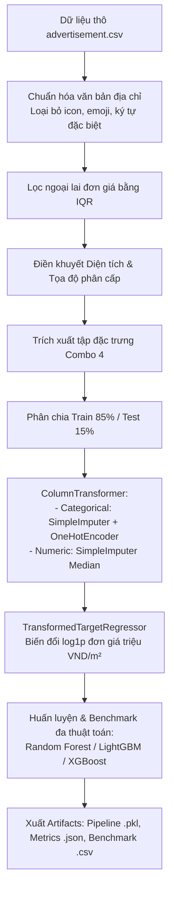

# Dự đoán giá bất động sản tại Việt Nam bằng Machine Learning

[](https://www.python.org/)
[](https://scikit-learn.org/)
[](https://gradio.app/)
[](LICENSE)

> **Đồ án môn học:** Trực quan hóa dữ liệu & Ứng dụng Machine Learning  
> **Chủ đề:** Nghiên cứu phân tích, trực quan hóa và xây dựng hệ thống Machine Learning dự đoán giá bất động sản tại thị trường Việt Nam dựa trên dữ liệu tin đăng quảng cáo (`advertisement.csv`).

---

## Mục lục
- [1. Giới thiệu tổng quan](#1-giới-thiệu-tổng-quan)
- [2. Cấu trúc thư mục dự án](#2-cấu-trúc-thư-mục-dự-án)
- [3. Dữ liệu và phân tích khám phá (EDA)](#3-dữ-liệu-và-phân-tích-khám-phá-eda)
  - [3.1. Tổng quan tập dữ liệu](#31-tổng-quan-tập-dữ-liệu)
  - [3.2. Phân tích thống kê và kiểm định giả thuyết](#32-phân-tích-thống-kê-và-kiểm-định-giả-thuyết)
  - [3.3. Lựa chọn tổ hợp đặc trưng (Combo 4)](#33-lựa-chọn-tổ-hợp-đặc-trưng-combo-4)
- [4. Quy trình tiền xử lý và pipeline Machine Learning](#4-quy-trình-tiền-xử-lý-và-pipeline-machine-learning)
  - [4.1. Tiền xử lý và làm sạch dữ liệu](#41-tiền-xử-lý-và-làm-sạch-dữ-liệu)
  - [4.2. Điền khuyết dữ liệu phân cấp (Hierarchical Imputation)](#42-điền-khuyết-dữ-liệu-phân-cấp-hierarchical-imputation)
  - [4.3. Kiến trúc pipeline học máy và biến đổi biến mục tiêu](#43-kiến-trúc-pipeline-học-máy-và-biến-đổi-biến-mục-tiêu)
- [5. Kết quả thực nghiệm và đánh giá mô hình](#5-kết-quả-thực-nghiệm-và-đánh-giá-mô-hình)
  - [5.1. Chiến lược định tuyến mô hình theo phân khúc (Type-Specific Routing)](#51-chiến-lược-định-tuyến-mô-hình-theo-phân-khúc-type-specific-routing)
  - [5.2. Bảng so sánh kết quả benchmark](#52-bảng-so-sánh-kết-quả-benchmark)
  - [5.3. Nhận xét và phân tích kết quả](#53-nhận-xét-và-phân-tích-kết-quả)
- [6. Ứng dụng web dự đoán (Gradio UI)](#6-ứng-dụng-web-dự-đoán-gradio-ui)
  - [6.1. Các tính năng chính](#61-các-tính-năng-chính)
  - [6.2. Cơ chế ánh xạ địa chỉ hành chính](#62-cơ-chế-ánh-xạ-địa-chỉ-hành-chính)
- [7. Hướng dẫn cài đặt và chạy dự án](#7-hướng-dẫn-cài-đặt-và-chạy-dự-án)
  - [7.1. Cài đặt môi trường](#71-cài-đặt-môi-trường)
  - [7.2. Huấn luyện lại mô hình](#72-huấn-luyện-lại-mô-hình)
  - [7.3. Khởi chạy giao diện web](#73-khởi-chạy-giao-diện-web)
- [8. Công nghệ và thư viện sử dụng](#8-công-nghệ-và-thư-viện-sử-dụng)
- [9. Thành viên thực hiện](#9-thành-viên-thực-hiện)

---

## 1. Giới thiệu tổng quan

Định giá bất động sản là một bài toán hồi quy (Regression) phức tạp trong học máy có giám sát (Supervised Learning). Tại thị trường Việt Nam, dữ liệu bất động sản thường có độ phân tán cao, chịu ảnh hưởng mạnh bởi yếu tố địa lý, phân khúc sản phẩm, biến động đơn giá theo từng tuyến đường, cũng như hiện tượng lệch phải (right-skewed) rõ rệt của giá bán.

Dự án này nghiên cứu và triển khai giải pháp Machine Learning toàn diện:
1. **Phân tích khám phá dữ liệu (EDA):** Kiểm định thống kê, đo lường liên kết phi tuyến giữa các thuộc tính bằng hệ số Cramer's V hiệu chỉnh, và xác định tổ hợp đặc trưng tối ưu.
2. **Quy trình tiền xử lý phân cấp (Hierarchical Preprocessing Pipeline):** Xử lý văn bản tự động, điền khuyết diện tích và tọa độ theo cấu trúc cây hành chính, lọc ngoại lai bằng IQR.
3. **Mô hình hóa với Ensemble & Gradient Boosting:** Ứng dụng các thuật toán Random Forest, LightGBM và XGBoost, kết hợp biến đổi Log-Target trên đơn giá mục tiêu.
4. **Hệ thống định tuyến mô hình đa phân khúc (Multi-tier Model Routing):** Tự động lựa chọn mô hình toàn cục (Global Model) hoặc mô hình chuyên biệt từng loại hình (Type-Specific Model) dựa trên thực nghiệm.
5. **Triển khai ứng dụng (Gradio Web UI):** Xây dựng giao diện web cho phép người dùng nhập thông tin theo địa giới hành chính mới, tự động quy đổi và ước lượng giá trị tài sản cùng khoảng tin cậy sai số.

---

## 2. Cấu trúc thư mục dự án

```text
Machine-Learning-for-Housing-Price/
│
├── advertisement.csv                    # Tập dữ liệu gốc tin đăng bất động sản (~37.000 dòng)
├── feature.ipynb                        # Phân tích khám phá dữ liệu (EDA), kiểm định thống kê và Cramer's V
├── train_combo4_xgboost_pipeline.py     # Pipeline tiền xử lý, huấn luyện đa mô hình và xuất artifact
├── app.py                               # Ứng dụng web dự đoán giá tương tác (Gradio)
├── requirements.txt                     # Danh sách các thư viện phụ thuộc
│
├── artifacts/                           # Thư mục lưu trữ artifact mô hình và kết quả thực nghiệm
│   ├── combo4_best_unit_price_pipeline.pkl  # Pipeline mô hình đã huấn luyện (quản lý qua Git LFS)
│   ├── combo4_unit_price_metrics.json       # Metrics đánh giá và cấu hình mô hình
│   └── combo4_unit_price_benchmark.csv     # Bảng dữ liệu so sánh chi tiết benchmark các mô hình
│
├── .gitattributes                       # Cấu hình Git LFS cho file model nhị phân (.pkl)
├── .gitignore                           # Cấu hình loại trừ file tạm và môi trường ảo
└── README.md                            # Tài liệu báo cáo dự án
```

---

## 3. Dữ liệu và phân tích khám phá (EDA)

### 3.1. Tổng quan tập dữ liệu
Tập dữ liệu `advertisement.csv` chứa thông tin từ hơn **37.000 bản ghi** tin rao bán bất động sản tại Việt Nam, bao gồm:
- **Thông tin vị trí:** Tỉnh/Thành phố mới, Phường mới, Tỉnh/Thành phố cũ, Huyện/Quận cũ, Phường/Xã cũ, Đường, Số nhà, Kinh độ, Vĩ độ.
- **Thuộc tính tài sản:** Loại hình bất động sản (Căn hộ/Chung cư, Nhà ở, Đất, Văn phòng/Mặt bằng kinh doanh), Diện tích, Chiều dài, Chiều rộng, Số tầng, Số phòng ngủ, Số phòng vệ sinh, Giấy tờ pháp lý, Đặc điểm nhà/đất.
- **Phân loại chi tiết (Subtypes):** Loại hình nhà ở, Loại hình căn hộ, Loại hình đất, Loại hình văn phòng.
- **Biến mục tiêu:** Giá bán (VND) và Đơn giá (triệu VND/m²).

### 3.2. Phân tích thống kê và kiểm định giả thuyết
Trong notebook `feature.ipynb`, các phương pháp phân tích thống kê được thực hiện:
- **Kiểm tra phân phối và xử lý ngoại lai:** Giá bán và đơn giá có phân phối lệch phải mạnh với phương sai lớn. Áp dụng khoảng phân vị $1.5 \times \text{IQR}$ để xác định và xử lý các giá trị bất thường.
- **Kiểm định phi tham số Kruskal-Wallis:** Kiểm tra sự khác biệt về phân phối đơn giá giữa các nhóm loại hình bất động sản ($p < 0.001$), khẳng định tính cần thiết của việc phân tách mô hình theo phân khúc.
- **Kiểm định hậu nghiệm Mann-Whitney U:** Sử dụng hiệu chỉnh Bonferroni để so sánh từng cặp phân khúc nhằm đánh giá mức độ dị biệt giữa các loại hình tài sản.
- **Ma trận liên kết Cramer's V có hiệu chỉnh (Bias-corrected Cramer's V):** Đo lường mức độ tương quan phi tuyến giữa các biến phân loại và các khoảng giá trị của biến mục tiêu, tránh hiện tượng đánh giá quá cao tương quan do số lượng nhóm lớn (high cardinality).

### 3.3. Lựa chọn tổ hợp đặc trưng (Combo 4)
Sau khi thử nghiệm và đánh giá 15 tổ hợp đặc trưng khác nhau bằng điểm số Cramer's V, tổ hợp **Combo 4** được lựa chọn phục vụ quá trình huấn luyện:

$$\text{Combo 4} = \{\text{Đường}, \text{Huyện/Quận cũ}, \text{Tỉnh/Thành phố cũ}, \text{Loại hình}, \text{Diện tích}, \text{Số phòng ngủ}, \text{Số phòng vệ sinh}, \text{4 cột phân loại chi tiết (Subtypes)}\}$$

Tổ hợp này tối ưu hóa khả năng biểu diễn thông tin địa phương kết hợp cấu trúc tài sản, đồng thời giảm thiểu hiện tượng quá khớp (overfitting) khi mô hình hóa.

---

## 4. Quy trình tiền xử lý và pipeline Machine Learning



### 4.1. Tiền xử lý và làm sạch dữ liệu
- **Chuẩn hóa văn bản:** Loại bỏ các ký tự biểu cảm (emoji, unicode icons), chuẩn hóa khoảng trắng và xử lý các ký tự trang trí ở đầu/cuối chuỗi địa chỉ.
- **Chuyển đổi kiểu dữ liệu:** Trích xuất và ép kiểu an toàn cho các trường số nguyên, số thực, ngày đăng và giá trị boolean.
- **Lọc ngoại lai (Outlier Filtering):** Loại bỏ các điểm dữ liệu có đơn giá vượt ngoài ngưỡng $[Q_1 - 1.5 \times \text{IQR}, Q_3 + 1.5 \times \text{IQR}]$ của tập đơn giá hợp lệ.

### 4.2. Điền khuyết dữ liệu phân cấp (Hierarchical Imputation)
- **Điền khuyết diện tích:**
  1. Tính trực tiếp từ kích thước hình học: $\text{Chiều dài} \times \text{Chiều rộng}$.
  2. Suy diễn từ giá bán và đơn giá: $\frac{\text{Giá bán}}{\text{Đơn giá} \times 1.000.000}$.
  3. Điền giá trị trung bình phân nhóm theo cụm `(Loại hình, Huyện/Quận cũ, Khu vực)`.
- **Điền khuyết tọa độ:**
  - Áp dụng kỹ thuật phân cấp không gian: gán tọa độ trung bình từ mức độ chi tiết cao đến thấp: `Đường` $\rightarrow$ `Phường` $\rightarrow$ `Quận/Huyện` $\rightarrow$ `Tỉnh/Thành phố`.
  - Hỗ trợ cơ chế Geocoding chính xác cao qua Google Geocoding API khi có cấu hình API key.

### 4.3. Kiến trúc pipeline học máy và biến đổi biến mục tiêu
Thay vì dự đoán trực tiếp tổng giá bán (dễ bị chi phối bởi quy mô diện tích lớn), mô hình học máy được thiết kế để dự đoán **Đơn giá trên một mét vuông** (`Đơn giá mục tiêu` - đơn vị: triệu VND/m²).

Giá bán cuối cùng được tái cấu trúc theo công thức:
$$\hat{y}_{\text{giá bán}} = \hat{y}_{\text{đơn giá}} \times \text{Diện tích} \times 1.000.000$$

Đơn giá mục tiêu được xử lý qua `TransformedTargetRegressor` với hàm biến đổi:
$$z = \log(1 + y)$$
$$y = \exp(z) - 1$$

Phương pháp này giúp ổn định hàm mất mát (loss function), giảm độ nhạy với các giá trị cực trị và cải thiện đáng kể chỉ số RMSLE.

---

## 5. Kết quả thực nghiệm và đánh giá mô hình

### 5.1. Chiến lược định tuyến mô hình theo phân khúc (Type-Specific Routing)
Dự án áp dụng chiến lược so khớp kép trên tập kiểm thử độc lập (Test set chiếm 15% dữ liệu, tương đương 5.604 mẫu):
- **Mô hình toàn cục (`all_model`):** Huấn luyện trên toàn bộ tập dữ liệu đa dạng.
- **Mô hình chuyên biệt (`type_specific`):** Huấn luyện riêng biệt cho các loại hình có số lượng mẫu lớn hơn ngưỡng $\ge 300$.
- **Bộ định tuyến (Router):** Lựa chọn mô hình đạt sai số MAE (tỷ VND) và RMSLE nhỏ nhất cho từng phân khúc tương ứng.

### 5.2. Bảng so sánh kết quả benchmark

Dưới đây là kết quả thực nghiệm tổng hợp từ `artifacts/combo4_unit_price_benchmark.csv`:

| Phân khúc | Số mẫu (Train / Test) | Thuật toán tối ưu | Nguồn mô hình | MAE (tỷ VND) | RMSLE | Hit $\le$ 0.5 tỷ (%) | Hit $\le$ 10% (%) | Hit $\le$ 20% (%) |
| :--- | :---: | :---: | :---: | :---: | :---: | :---: | :---: | :---: |
| **Toàn bộ dữ liệu (ALL)** | 31.755 / 5.604 | **Random Forest Regressor** | `type_specific` | **1.924** | **0.440** | **39.24%** | **35.37%** | **58.64%** |
| **Căn hộ/Chung cư** | 4.903 / 880 | **Random Forest Regressor** | `all_model` | **0.653** | **0.371** | **66.82%** | **52.27%** | **72.73%** |
| **Nhà ở** | 19.281 / 3.414 | **Random Forest Regressor** | `all_model` | **1.542** | **0.316** | **35.44%** | **35.65%** | **61.36%** |
| **Đất** | 7.161 / 1.247 | **XGBoost Regressor** | `type_specific` | **3.421** | **0.598** | **27.67%** | **18.68%** | **38.25%** |
| **Văn phòng, Mặt bằng** | 410 / 63 | **Random Forest Regressor** | `type_specific` | **8.399** | **1.682** | **11.11%** | **6.35%** | **17.46%** |

### 5.3. Nhận xét và phân tích kết quả
- **Phân khúc Căn hộ/Chung cư:** Đạt độ chính xác cao nhất với MAE chỉ **0.653 tỷ VND** (~653 triệu VND). Tỷ lệ dự đoán có sai số trong khoảng $\le 20\%$ đạt tới **72.73%**, do đặc tính giá chung cư có tính đồng nhất cao theo dự án và khu vực.
- **Phân khúc Nhà ở:** Chiếm phần lớn dung lượng dữ liệu (hơn 22.000 mẫu), đạt chỉ số RMSLE tốt nhất toàn hệ thống (**0.316**), với hơn **61.36%** số mẫu dự đoán sai lệch dưới 20%.
- **Phân khúc Đất:** Thuật toán **XGBoost Regressor** cho thấy hiệu quả vượt trội hơn so với Random Forest và LightGBM, giúp giảm thiểu độ phân tán của giá đất nền.
- **Phân khúc Văn phòng / Mặt bằng kinh doanh:** Số lượng mẫu còn hạn chế và khoảng giá biến động rất rộng (từ vài tỷ đến hàng chục tỷ), dẫn đến sai số tuyệt đối cao hơn các nhóm còn lại.

---

## 6. Ứng dụng web dự đoán (Gradio UI)

### 6.1. Các tính năng chính
Giao diện người dùng được xây dựng hoàn chỉnh trong `app.py` với các chức năng:
- **Lựa chọn vị trí phân cấp:** Dropdown tự động cập nhật liên hoàn từ Tỉnh/Thành phố mới $\rightarrow$ Phường/Xã mới $\rightarrow$ Đường.
- **Thích ứng biểu mẫu động (Dynamic Form):** Tự động hiển thị các lựa chọn phân loại con tương ứng với loại hình được chọn (ví dụ: chọn "Nhà ở" sẽ hiển thị dropdown "Loại hình nhà ở").
- **Dự đoán và xuất khoảng tin cậy:** Cung cấp giá trị ước lượng theo đơn vị VND, tỷ VND, đơn vị triệu/m² và khoảng giá tin cậy dựa trên sai số chuẩn MAE của mô hình.
- **Bảng thống kê hiệu năng mô hình:** Hiển thị trực quan bảng benchmark các mô hình tối ưu theo từng phân khúc.

### 6.2. Cơ chế ánh xạ địa chỉ hành chính
Do dữ liệu hành chính tại Việt Nam có sự thay đổi giữa các giai đoạn (sáp nhập đơn vị hành chính, điều chỉnh tên gọi), ứng dụng cài đặt thuật toán ánh xạ tự động:
1. Người dùng nhập liệu theo chuẩn địa chỉ mới (`Tỉnh/Thành phố mới`, `Phường mới`, `Đường`).
2. Thuật toán tra cứu dữ liệu gốc và truy xuất danh sách ứng viên địa chỉ cũ tương ứng (`Phường/Xã cũ`, `Huyện/Quận cũ`, `Tỉnh/Thành phố cũ`).
3. Tự động chọn địa chỉ cũ có tần suất khớp cao nhất, hoặc cho phép người dùng tùy chỉnh nếu phát hiện nhiều phương án phù hợp, đảm bảo dữ liệu đưa vào mô hình học máy đạt độ chính xác cao nhất.

---

## 7. Hướng dẫn cài đặt và chạy dự án

### 7.1. Cài đặt môi trường

Yêu cầu: **Python 3.10 trở lên** và **Git LFS** (để quản lý file mô hình lớn).

```bash
# 1. Clone repository về máy
git clone https://github.com/AnhTtis/Machine-Learning-for-Housing-Price.git
cd Machine-Learning-for-Housing-Price

# 2. Khởi tạo Git LFS và tải file model nhị phân
git lfs install
git lfs pull

# 3. Tạo môi trường ảo
python -m venv venv

# Kích hoạt môi trường ảo:
# Trên Windows (PowerShell):
.\venv\Scripts\Activate.ps1
# Trên Linux / macOS:
source venv/bin/activate

# 4. Cài đặt các gói thư viện
pip install -r requirements.txt
```

### 7.2. Huấn luyện lại mô hình

Để tái hiện lại toàn bộ quy trình tiền xử lý, benchmark và xuất artifact mô hình mới:

```bash
python train_combo4_xgboost_pipeline.py
```

*Quá trình này sẽ đọc dữ liệu từ `advertisement.csv`, huấn luyện các mô hình Machine Learning và tự động cập nhật kết quả vào thư mục `artifacts/`.*

### 7.3. Khởi chạy giao diện web

Chạy lệnh sau để khởi động ứng dụng Gradio:

```bash
python app.py
```

Sau khi ứng dụng khởi chạy thành công, truy cập đường dẫn sau trên trình duyệt:
```text
http://localhost:7860
```

---

## 8. Công nghệ và thư viện sử dụng

| Phân loại | Thư viện / Công cụ | Mục đích sử dụng |
| :--- | :--- | :--- |
| **Ngôn ngữ** | `Python 3.10+` | Phát triển toàn bộ mã nguồn xử lý và mô hình hóa |
| **Xử lý dữ liệu** | `Pandas`, `NumPy`, `SciPy` | Tiền xử lý dữ liệu, ma trận thưa và phân tích thống kê |
| **Trực quan hóa** | `Matplotlib`, `Seaborn` | Trực quan phân phối, biểu đồ tương quan và kiểm định ngoại lai |
| **Machine Learning** | `Scikit-Learn` | Pipeline biến đổi đặc trưng, Imputer, OneHotEncoder, Random Forest |
| **Thuật toán Boosting** | `XGBoost`, `LightGBM` | Huấn luyện mô hình cây quyết định tăng cường gradient |
| **Lưu trữ mô hình** | `Joblib`, `Git LFS` | Serialize pipeline mô hình và quản lý file nhị phân lớn |
| **Giao diện người dùng** | `Gradio` | Xây dựng giao diện web tương tác trực quan |
| **Địa lý / Bản đồ** | `Google Geocoding API` | (Tùy chọn) Tra cứu tọa độ địa lý chính xác |

---

## 9. Thành viên thực hiện
- **Sinh viên thực hiện:** AnhTtis & Nhóm nghiên cứu
- **Học kỳ:** Năm 3 - Học kỳ 8
